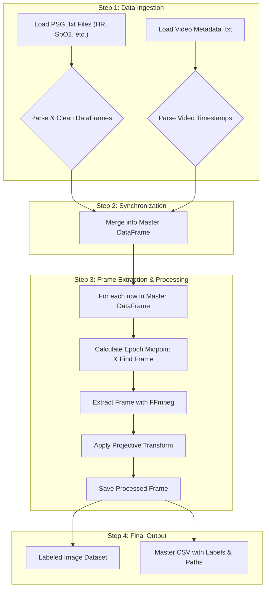

# Multimodal Clinical Sleep Data Preprocessing Pipeline


This project is designed to synchronise time-series physiological data from Polysomnography (PSG) and  infrared video recordings, preparing the dataset for machine learning analysis.

---

## Table of Contents
- [Key Features](#key-features)
- [Workflow Overview](#workflow-overview)
- [Prerequisites](#prerequisites)
- [Installation](#installation)
- [Usage](#usage)
- [Code Description](#code-description)
- [Author](#author)
- [License](#license)

---

## Key Features

* **Multimodal Data Parsing:** Efficiently parses and cleans multiple time-series PSG data streams, including Heart Rate, SpO₂, PSG Body Position, and Sleep Stage data from.
* **Video & PSG Synchronization:** synchronises the time-series physiological data with video recording based on metadata.
* **Epoch-based Frame Extraction:** Extracts specific video frames corresponding to the midpoint of each 30-second physiological epoch using `ffmpeg` for accurate temporal alignment.
* **Image Preprocessing & Normalization:** Applies a projective transformation (homography) to each extracted frame to isolate a consistent region of interest (e.g., the bed), correcting for camera perspective and ensuring spatial consistency across all images.
* **Robust Error Handling:** Includes logging and error handling, such as missing files or corrupted data.

---

## Workflow Overview

The pipeline follows a systematic process to transform raw, unsynchronized clinical data into a machine-learning-ready dataset.



---

## Prerequisites

* **Python 3.9+**
* **FFmpeg:** This pipeline relies on `ffmpeg` for video processing. You must have it installed and accessible in your system's PATH. You can download it from [ffmpeg.org](https://ffmpeg.org/download.html).

---

## Installation

    ```

 **Install the required Python libraries:**
    ```
    numpy
    matplotlib
    scikit-image
    pandas
    ffmpeg-python
    ```

---

## Usage

1.  **Directory Structure:**
    Ensure data is organised in the expected directory structure. The script is configured to locate files based on a root directory and a participant ID.
    ```
    D:/root_folder/
    |
    |-- Participant_1/
    |   |-- Participant_1_video/
    |   |   |-- video1.mp4
    |   |   |-- video2.mp4
    |   |   '-- video_metadata.txt
    |   |
    |   '-- video_frames/  <-- This will be created by the script
    |
    '-- Participant_1_variables/
        |-- Heart Rate.txt
        |-- Position.txt
        |-- SpO2.txt
        '-- Sleep profile.txt
    ```

2.  **Configure the Script:**
    Open the main Python script and modify the following variables at the bottom of the file:
    * `participant_id`: Set this to the ID of the participant you wish to process.
    * `root_dir`: (Optional) Change the root directory if your data is stored elsewhere.

3.  **Run the script:**
    ```bash
    python your_script_name.py
    ```
    The script will log its progress to the console and save the processed frames in the specified output directory.

---

## Code Description

* `project_transform()`: Applies a projective transformation to an image to warp a defined source quadrilateral to a destination quadrilateral, normalising the perspective.
* `build_file_paths()`: Constructs all necessary input and output file paths based on a participant ID and a root directory.
* `heart_file()`, `positions_file()`, etc.: A series of parser functions designed to read `.txt` files, handle header irregularities, and load the data into Pandas DataFrames.
* `parse_video_metadata()`: Reads the video metadata file to extract the start times and filenames for each video segment.
* `find_valid_start_epoch()`: Aligns video start times to the nearest 30-second epoch boundary to ensure correct synchronisation with PSG data.
* `sync_psg_with_video()`: Merges the physiological data with the video metadata to create a master DataFrame where each physiological reading is mapped to a specific video file.
* `extract_frames_from_videos()`: The core function that iterates through the synchronised data, calculates the precise timestamp for frame extraction, uses `ffmpeg` to extract the frame, applies the projective transform, and saves the final processed image.

---

## Author

**Dr. Sarmad Mueen**
* GitHub: [@your-github-username](https://github.com/your-github-username)
---

## License

This project is licensed under the MIT License - see the [LICENSE.md](LICENSE.md) file for details.
